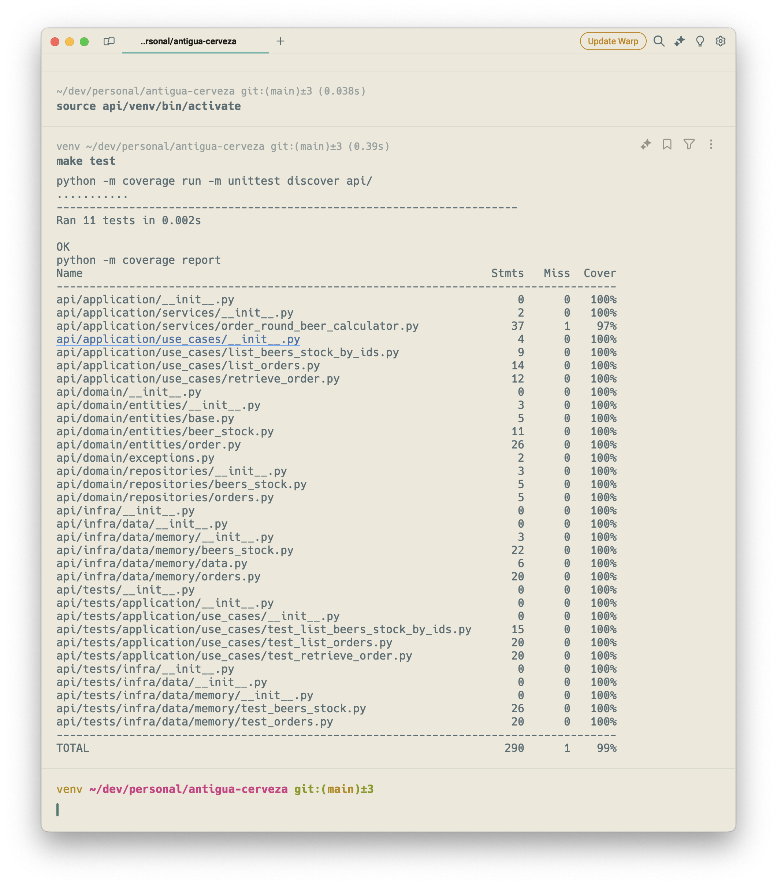

# Antigua Cerveza – Orders App

This project is inpired from craft brewry [Antigua Cerveza](https://www.antiguacerveza.com/english). Based on Antigua Guatemala.

## Demo


## Setup

### API
1. Install Python 3.11
2. Create a virtual environmnet at `/api` running
```bash
python3.11 -m venv api/venv
```
3. Activate your virutal environment
```bash
source api/venv/bin/activate
```
4. Install all dependencies
```bash
pip install -r api/requirements.txt
```

### Web
1. Install and use NodeJS 20.x
2. Install [PNPM](https://pnpm.io/)
3. Install all dependencies
```bash
cd web && pnpm i
```

### Run App
1. Activate your virtual environment
```bash
source api/venv/bin/activate
```
2. Run API and Web from root dir
```bash
make dev
```

## Unit tests

### API
1. Activate your vitual environment from root directory
```bash
source api/venv/bin/activate
```
2. Run unit test
```bash
make test
```

Or your can run this for generate a coverage report
```bash
make test-report
```



## Project info

If you want to know more about how this project was made, please read the links below:
* [API](./api)
* [Web](./web)
